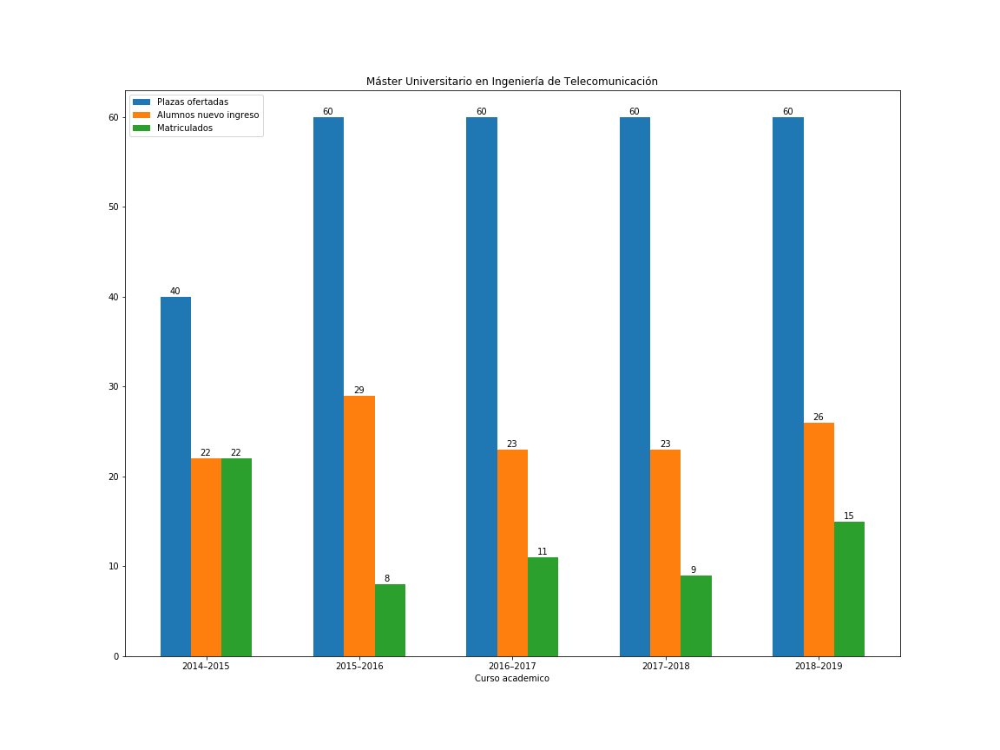
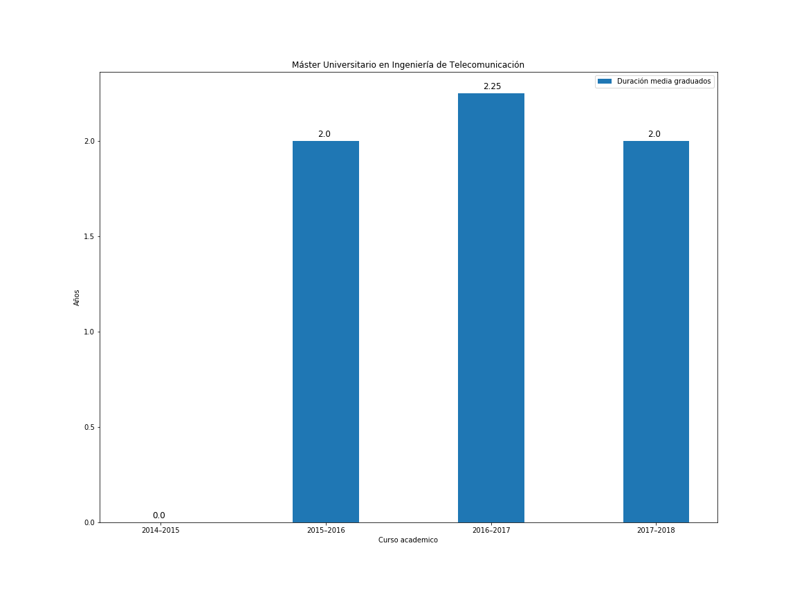

# UnizarWebScrapper

A simple project to demonstrate the use of Python to visualize some stats scrapped from Unizar bachelor and master degrees database and generate some plots with Matplotlib.

## Requirements

This projects requires Numpy and Pandas packages to be installed in your system. It also needs BeatifulSoup package to parse HTML info. The ploting stuff relies on Matplotlib library

## Plots generated

Some example plots can be seen in figures_examples/

Matricula y acceso:
 

Duracion media graduados:
 
